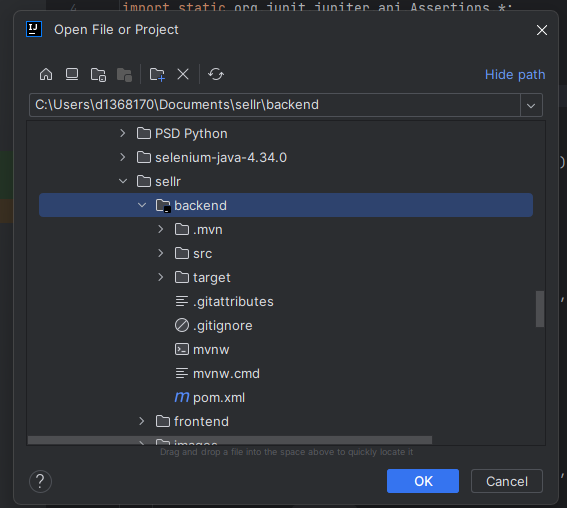
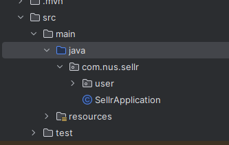

# Sellr Development Guide
Last updated 12 August 2025

## Pre-Requisite
- VSCode [(link)](https://code.visualstudio.com/) 
- IntelliJ CE [(link)](https://www.jetbrains.com/idea/download/download-thanks.html?platform=windows&code=IIC)
- Java 17 
- MongoDB [(link)](https://www.mongodb.com/try/download/community) NOTE: in the final step of installation, download MongoDB Compass (GUI for Database)
- Node.js and npm [(link)](https://nodejs.org/dist/v22.18.0/node-v22.18.0-x64.msi)
- Maven [(link)](https://dlcdn.apache.org/maven/maven-3/3.9.11/binaries/apache-maven-3.9.11-bin.zip) 
Put Maven into C:/Apache/apache-maven.3.9.11, and change environment variable of `%MAVEN_HOME%`. 

## File Structure 
```plaintext
backend/
├── src/
│   ├── main/ (Java files will be located here) 
│   └── test/ (Test files will be located here)
frontend/
├── public/ (resources root folder)
└── src/ (where all the files will be at)
```

## Set-Up 

### Database
Currently we will be using our local database. Ensure connection string is mongodb://localhost:27017/ 
We will change this string once we move into deployment.


### Backend 
From IntelliJ, only open the backend folder. (opening the full directory will cause issues as IntelliJ won't be able to detect the Java codes.)



- Ensure JDK 17 is selected in the project settings. 
(Project Structure -> Project)
- Ensure you have maven installed on your computer too (ensure IntelliJ is using the correct Maven. If using Nexus Spark might run into issues. Install fresh Maven from the link, and point IntelliJ to the new Maven)


- Ensure that the java folder in main is marked as root directory. 
(Right click on the folder in IntelliJ -> Mark Directory As -> Sources Root)

- Run `mvn clean install` to install dependencies required. 
- Build the project 
- Run `mvn spring-boot:run` to start the backend application.

### Frontend 

- Run commmand prompt, change directory to the frontend/ folder. 
- Run `npm i` to install the required dependencies. 
- Run `npm run start` to start the frontend application. 